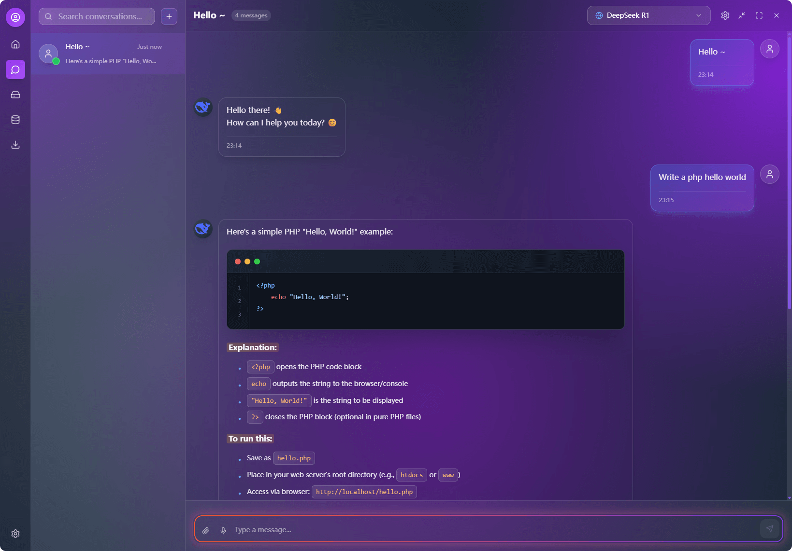
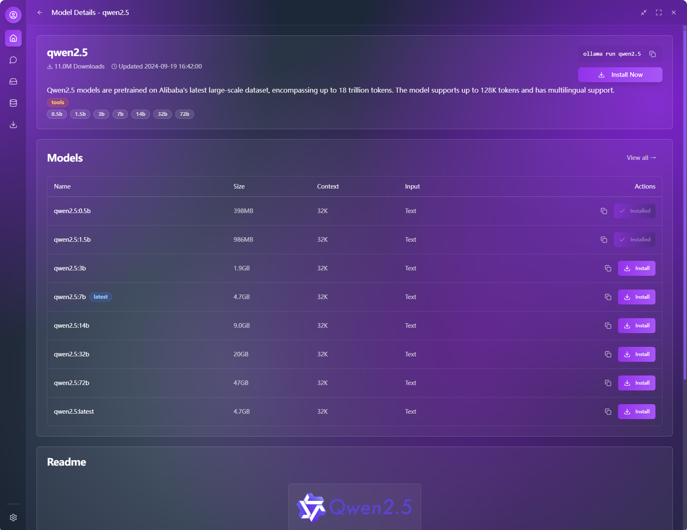

# Ollama Pro

[](LICENSE)
[](https://github.com/downly-app/ollama.vip/releases)
[](https://github.com/downly-app/ollama.vip/releases)

A modern, cross-platform desktop application for interacting with Ollama models. Built with React, TypeScript, and Tauri for optimal performance and security.

> 🤖 **AI-Powered Development**: This project was collaboratively developed using AI-assisted coding (vibe coding) with WindSurf + Cursor + Trae + Lovable (UI and frontend design) + Manus (early research and requirements analysis), primarily powered by Claude 4 and Gemini 2.5 Pro models.

**Main Dashboard Interface:**


*The main dashboard provides an overview of system status, model management, and quick access to key features.*

## ✨ Features

### 🤖 AI Chat
- **Multi-model Support**: Compatible with OpenAI and DeepSeek models
- **Real-time Conversation**: Smooth streaming chat experience
- **Message Management**: Edit, delete, copy, and resend messages
- **Conversation History**: Persistent chat history with search functionality
- **Markdown Rendering**: Full support for code highlighting and formatting


**AI Chat Interface:**



*Clean and intuitive chat interface with message history, markdown support, and real-time streaming responses.*

**Third-party Model API Configuration:**


*Easy configuration panel for setting up API keys and parameters for OpenAI, DeepSeek, and other AI providers.*

### 🎨 User Interface
- **Modern Design**: Glass-morphism UI with smooth animations
- **Theme System**: Multiple built-in themes with gradient effects
- **Responsive Layout**: Adaptive interface for different screen sizes
- **Dark Mode**: Eye-friendly dark interface
- **Internationalization**: Support for English, Chinese, Japanese, Korean, and French

### 🔧 Model Management
- **Model Overview**: View and manage available AI models
- **Provider Selection**: Switch between different AI service providers
- **Configuration Management**: Easy API key and parameter configuration


**Local Model Management:**


*Comprehensive view of locally installed models with options to manage, update, and remove models.*

**Local Model Details:**


*Detailed information about each model including size, parameters, and performance metrics.*

**Online Model Library:**


*Browse and discover available models from the Ollama library with one-click download functionality.*

**Model Information Page:**



*Comprehensive model details including description, capabilities, and system requirements before download.*

**Download Management:**


*Real-time download progress tracking with pause, resume, and cancel options for model installations.*

### ⚙️ System Features
- **Cross-platform**: Windows, macOS, and Linux support
- **Native Performance**: Built with Tauri for optimal performance
- **Data Persistence**: Local storage for settings and chat history
- **Keyboard Shortcuts**: Efficient keyboard navigation

## 📦 Installation

### Prerequisites

- [Ollama](https://ollama.ai/) installed and running
- Node.js 18+ and Yarn (for development)
- Rust (for building from source)

### Download Pre-built Binaries

1. Go to the [Releases](https://github.com/downly-app/ollama.vip/releases) page
2. Download the appropriate installer for your platform:

#### Windows
- **MSI Installer**: `ollama-pro_x.x.x_x64_en-US.msi` (Recommended)
- **NSIS Installer**: `ollama-pro_x.x.x_x64-setup.exe`

#### macOS
- **DMG Package**: `ollama-pro_x.x.x_x64.dmg` (Intel)
- **DMG Package**: `ollama-pro_x.x.x_aarch64.dmg` (Apple Silicon)
- **App Bundle**: `ollama-pro.app.tar.gz`

#### Linux
- **Debian Package**: `ollama-pro_x.x.x_amd64.deb` (Ubuntu/Debian)
- **RPM Package**: `ollama-pro_x.x.x_x86_64.rpm` (RHEL/Fedora/SUSE)
- **AppImage**: `ollama-pro_x.x.x_amd64.AppImage` (Universal)

### Build from Source

```bash
# Clone the repository
git clone https://github.com/downly-app/ollama.vip.git
cd ollama.vip

# Install dependencies
yarn install

# Start development server
yarn tauri:dev

# Build for production
yarn tauri:build

# Or use platform-specific build scripts
# Windows
yarn build:all

# Linux/macOS
yarn build:all:unix
```

### Automated Builds

Our GitHub Actions automatically build releases for all supported platforms:
- ✅ Windows (x64)
- ✅ macOS (Intel & Apple Silicon)
- ✅ Linux (x64)

All builds are:
- 🔒 **Digitally signed** (when certificates are available)
- 🛡️ **Security scanned** for vulnerabilities
- 📦 **Optimized** for size and performance
- 🧪 **Tested** across multiple environments

## 🚀 Quick Start

1. **Install and Launch**: Download and install the application for your platform
2. **Configure API**: Open settings and add your AI provider API key
3. **Select Model**: Choose your preferred AI model from the dropdown
4. **Start Chatting**: Begin your conversation with the AI assistant

## 📁 Project Structure

```
ollama.vip/
├── src/                    # Frontend source code
│   ├── components/         # React components
│   │   ├── ui/            # Base UI components
│   │   ├── layouts/       # Layout components
│   │   └── ...
│   ├── pages/             # Page components
│   ├── stores/            # Zustand state management
│   ├── services/          # API services
│   ├── utils/             # Utility functions
│   ├── contexts/          # React contexts
│   ├── i18n/              # Internationalization
│   │   └── locales/       # Translation files
│   └── styles/            # CSS styles
├── src-tauri/             # Tauri backend
│   ├── src/               # Rust source code
│   ├── Cargo.toml         # Rust dependencies
│   └── tauri.conf.json    # Tauri configuration
├── public/                # Static assets
└── docs/                  # Documentation
```

## 🔧 Configuration

### API Configuration
1. Open the application
2. Click the settings icon in the toolbar
3. Configure your API provider and key:
    - **OpenAI**: Enter your OpenAI API key
    - **DeepSeek**: Enter your DeepSeek API key
4. Select your preferred model
5. Adjust temperature and other parameters

### Language Settings
The application supports multiple languages:
- English (default)
- Chinese (Simplified)
- Japanese
- Korean
- French

Change language in Settings > Language Settings.

## 🛠️ Development

### Tech Stack
- **Frontend**: React 18.3 + TypeScript 5.5
- **Backend**: Tauri 1.5 + Rust
- **UI Framework**: Tailwind CSS + Radix UI
- **State Management**: Zustand
- **Build Tool**: Vite
- **Internationalization**: react-i18next

### AI Development Tools
- **Code Editors**: WindSurf + Cursor + Trae AI
- **UI/UX Design**: Lovable
- **Research & Analysis**: Manus
- **AI Models**: Claude 4 + Gemini 2.5 Pro
- **Development Approach**: Vibe Coding (AI-assisted development)

### Development Commands
```bash
# Start development server
npm run dev

# Start Tauri development
npm run tauri dev

# Build for production
npm run tauri build

# Type checking
npm run type-check

# Linting
npm run lint

# Format code
npm run format
```

### Adding New Features
1. Create components in `src/components/`
2. Add pages in `src/pages/`
3. Manage state with Zustand stores in `src/stores/`
4. Add translations in `src/i18n/locales/`
5. Update types in appropriate `.d.ts` files

## 📖 API Documentation

### Chat API
The application supports multiple AI providers:

#### OpenAI
- Models: GPT-4o, GPT-4o Mini, GPT-4 Turbo
- Endpoint: `https://api.openai.com/v1/chat/completions`

#### DeepSeek
- Models: DeepSeek-V3, DeepSeek-R1
- Endpoint: `https://api.deepseek.com/v1/chat/completions`

### Configuration Format
```typescript
interface AIConfig {
  provider: 'openai' | 'deepseek';
  apiKey: string;
  model: string;
  temperature: number;
}
```

## 🧪 Testing

```bash
# Run unit tests
npm run test

# Run integration tests
npm run test:integration

# Run e2e tests
npm run test:e2e
```

## 📦 Building and Distribution

### Development Build
```bash
npm run tauri dev
```

### Production Build
```bash
npm run tauri build
```

Build artifacts will be generated in `src-tauri/target/release/bundle/`.

### Platform-specific Notes
- **Windows**: Generates `.msi` installer
- **macOS**: Generates `.dmg` and `.app` bundle
- **Linux**: Generates `.deb` and `.AppImage`

## 🔍 Troubleshooting

### Common Issues

1. **Port 1421 already in use**
   ```bash
   # Kill the process using the port
   npx kill-port 1421
   # or
   lsof -ti:1421 | xargs kill -9
   ```

2. **Tauri build fails**
    - Ensure Rust is properly installed
    - Update Tauri CLI: `cargo install tauri-cli`
    - Clear cache: `cargo clean`

3. **API connection issues**
    - Verify API key is correct
    - Check network connectivity
    - Ensure API endpoint is accessible

### Debug Mode
Enable debug mode by setting environment variable:
```bash
TAURI_DEBUG=true npm run tauri dev
```

## 🤝 Contributing

We welcome contributions! Please see our [Contributing Guide](docs/CONTRIBUTING.md) for details.

### Development Workflow
1. Fork the repository
2. Create a feature branch
3. Make your changes
4. Add tests if applicable
5. Submit a pull request

### Code Style
- Use TypeScript for type safety
- Follow ESLint configuration
- Use Prettier for code formatting
- Write meaningful commit messages

## 📄 License

This project is licensed under the GNU General Public License v3 with Commercial Exception.

### Open Source Use
For non-commercial use (personal, educational, research), this software is available under GPL v3 terms.

### Commercial Use
Commercial use requires a separate commercial license. Contact us at [contact@ollama.vip] for commercial licensing.

See the [LICENSE](LICENSE) file for complete details.

## 🙏 Acknowledgments

### Frameworks & Libraries
- [Tauri](https://tauri.app/) - For the amazing desktop app framework
- [React](https://reactjs.org/) - For the UI library
- [Tailwind CSS](https://tailwindcss.com/) - For the utility-first CSS framework
- [Radix UI](https://www.radix-ui.com/) - For accessible UI components
- [Zustand](https://github.com/pmndrs/zustand) - For state management

### AI Development Tools
- [WindSurf](https://codeium.com/windsurf) - AI-powered code editor
- [Cursor](https://cursor.sh/) - AI-first code editor
- [Trae AI](https://trae.ai/) - Advanced AI coding assistant
- [Lovable](https://lovable.dev/) - AI-powered UI/UX design
- [Manus](https://manus.ai/) - AI research and analysis platform
- [Claude 4](https://claude.ai/) - Advanced AI language model by Anthropic
- [Gemini 2.5 Pro](https://gemini.google.com/) - Google's advanced AI model

### Development Philosophy
This project demonstrates the power of **AI-assisted development** (vibe coding), where human creativity and AI capabilities work together to create innovative software solutions.

## 📞 Support

If you encounter any issues or have questions:
- Create an issue on [GitHub Issues](https://github.com/downly-app/ollama.vip/issues)
- Check the [Documentation](docs/)
- Join our community discussions
- For commercial licensing inquiries: [contact@ollama.vip]