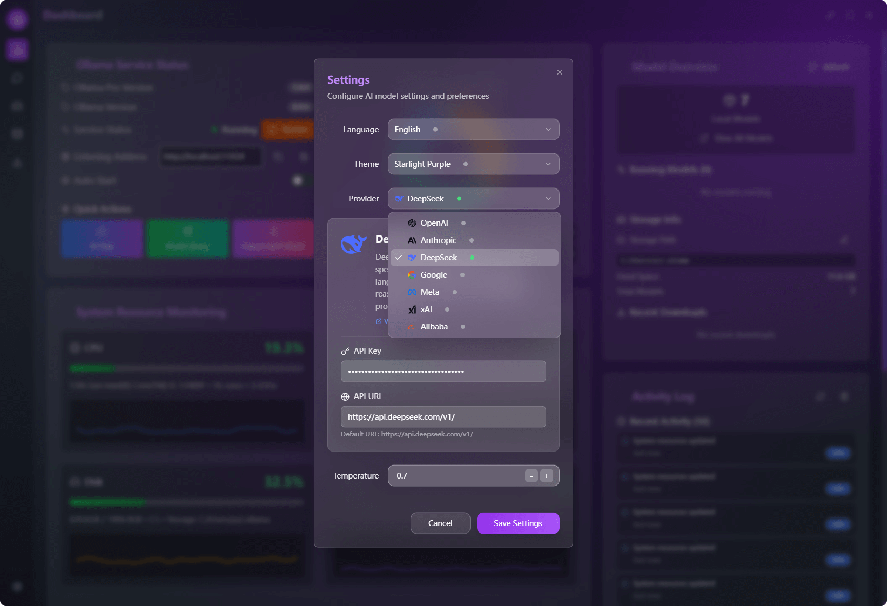
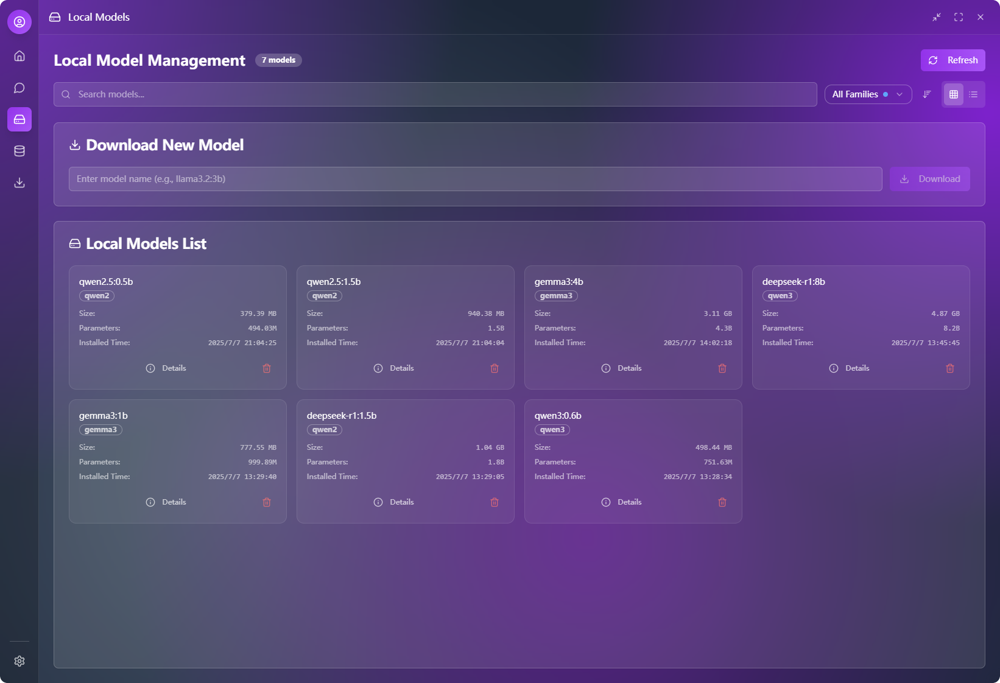
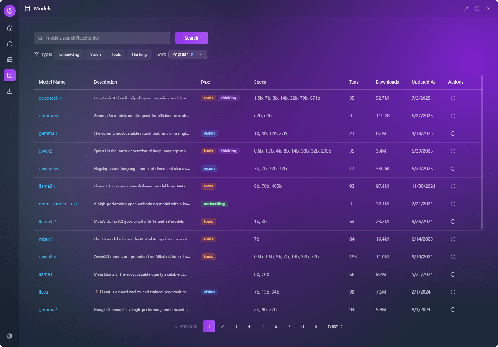

<div align="center">
<a href="https://github.com/putyy/res-downloader"></a>
<h1>Ollama Pro</h1>
</div>

**🌍 多言語版：**
[English](../../README.md) | [中文](../zh/README.md) | [한국어](../ko/README.md) | [Français](../fr/README.md)


[](https://github.com/downly-app/ollama.vip/stargazers)
[](https://github.com/downly-app/ollama.vip/fork)
[](LICENSE)
[](https://github.com/downly-app/ollama.vip/releases)
[](https://github.com/downly-app/ollama.vip/releases)

Ollamaモデルと対話するためのモダンなクロスプラットフォームデスクトップアプリケーション。最適なパフォーマンスとセキュリティのためにReact、TypeScript、Tauriで構築されています。

> 🤖 **AI駆動開発**: このプロジェクトは、WindSurf + Cursor + Trae + Lovable（UIとフロントエンドデザイン）+ Manus（初期研究と要件分析）を使用したAI支援コーディング（vibe coding）で協力開発され、主にClaude 4とGemini 2.5 Proモデルによって駆動されています。

**メインダッシュボードインターフェース：**


*メインダッシュボードは、システムステータスの概要、モデル管理、主要機能への迅速なアクセスを提供します。*

## ✨ 機能

### 🤖 AIチャット
- **マルチモデルサポート**: OpenAIとDeepSeekモデルに対応
- **リアルタイム会話**: スムーズなストリーミングチャット体験
- **メッセージ管理**: メッセージの編集、削除、コピー、再送信
- **会話履歴**: 検索機能付きの永続的なチャット履歴
- **Markdownレンダリング**: コードハイライトとフォーマットの完全サポート

**AIチャットインターフェース：**


*メッセージ履歴、markdownサポート、リアルタイムストリーミング応答を備えたクリーンで直感的なチャットインターフェース。*

**サードパーティモデルAPI設定：**



*OpenAI、DeepSeek、その他のAIプロバイダーのAPIキーとパラメータを設定するための簡単な設定パネル。*

### 🎨 ユーザーインターフェース
- **モダンデザイン**: スムーズなアニメーション付きのグラスモーフィズムUI
- **テーマシステム**: グラデーション効果付きの複数の内蔵テーマ
- **レスポンシブレイアウト**: 異なる画面サイズに適応するインターフェース
- **ダークモード**: 目に優しいダークインターフェース
- **国際化**: 英語、中国語、日本語、韓国語、フランス語をサポート

### 🔧 モデル管理
- **モデル概要**: 利用可能なAIモデルの表示と管理
- **プロバイダー選択**: 異なるAIサービスプロバイダー間の切り替え
- **設定管理**: 簡単なAPIキーとパラメータ設定

**ローカルモデル管理：**



*ローカルにインストールされたモデルの包括的なビューで、モデルの管理、更新、削除のオプションを提供。*

**ローカルモデル詳細：**


*サイズ、パラメータ、パフォーマンスメトリクスを含む各モデルの詳細情報。*

**オンラインモデルライブラリ：**



*ワンクリックダウンロード機能付きでOllamaライブラリから利用可能なモデルを閲覧・発見。*

**モデル情報ページ：**


*ダウンロード前の包括的なモデル詳細（説明、機能、システム要件を含む）。*

**ダウンロード管理：**


*モデルインストールの一時停止、再開、キャンセルオプション付きのリアルタイムダウンロード進捗追跡。*

### ⚙️ システム機能
- **クロスプラットフォーム**: Windows、macOS、Linuxサポート
- **ネイティブパフォーマンス**: 最適なパフォーマンスのためにTauriで構築
- **データ永続化**: 設定とチャット履歴のローカルストレージ
- **キーボードショートカット**: 効率的なキーボードナビゲーション

## 📦 インストール

### 前提条件

- [Ollama](https://ollama.ai/)がインストールされ実行中
- Node.js 18+とYarn（開発用）
- Rust（ソースからビルドする場合）

### プリビルドバイナリのダウンロード

1. [Releases](https://github.com/downly-app/ollama.vip/releases)ページにアクセス
2. お使いのプラットフォームに適したインストーラーをダウンロード：

#### Windows
- **MSIインストーラー**: `ollama-pro_x.x.x_x64_en-US.msi`（推奨）
- **NSISインストーラー**: `ollama-pro_x.x.x_x64-setup.exe`

#### macOS
- **DMGパッケージ**: `ollama-pro_x.x.x_x64.dmg`（Intel）
- **DMGパッケージ**: `ollama-pro_x.x.x_aarch64.dmg`（Apple Silicon）
- **Appバンドル**: `ollama-pro.app.tar.gz`

#### Linux
- **Debianパッケージ**: `ollama-pro_x.x.x_amd64.deb`（Ubuntu/Debian）
- **RPMパッケージ**: `ollama-pro_x.x.x_x86_64.rpm`（RHEL/Fedora/SUSE）
- **AppImage**: `ollama-pro_x.x.x_amd64.AppImage`（ユニバーサル）

### ソースからビルド

```bash
# リポジトリをクローン
git clone https://github.com/downly-app/ollama.vip.git
cd ollama.vip

# 依存関係をインストール
yarn install

# 開発サーバーを開始
yarn tauri:dev

# プロダクション用ビルド
yarn tauri:build

# またはプラットフォーム固有のビルドスクリプトを使用
# Windows
yarn build:all

# Linux/macOS
yarn build:all:unix
```

### 自動ビルド

私たちのGitHub Actionsは、サポートされているすべてのプラットフォーム用のリリースを自動的にビルドします：
- ✅ Windows (x64)
- ✅ macOS (Intel & Apple Silicon)
- ✅ Linux (x64)

すべてのビルドは：
- 🔒 **デジタル署名済み**（証明書が利用可能な場合）
- 🛡️ **セキュリティスキャン済み**（脆弱性チェック）
- 📦 **最適化済み**（サイズとパフォーマンス）
- 🧪 **テスト済み**（複数環境での検証）

## 🚀 クイックスタート

1. **インストールと起動**: お使いのプラットフォーム用のアプリケーションをダウンロードしてインストール
2. **API設定**: 設定を開いてAIプロバイダーのAPIキーを追加
3. **モデル選択**: ドロップダウンから希望するAIモデルを選択
4. **チャット開始**: AIアシスタントとの会話を開始

## 📁 プロジェクト構造

```
ollama.vip/
├── src/                    # フロントエンドソースコード
│   ├── components/         # Reactコンポーネント
│   │   ├── ui/            # ベースUIコンポーネント
│   │   ├── layouts/       # レイアウトコンポーネント
│   │   └── ...
│   ├── pages/             # ページコンポーネント
│   ├── stores/            # Zustand状態管理
│   ├── services/          # APIサービス
│   ├── utils/             # ユーティリティ関数
│   ├── contexts/          # Reactコンテキスト
│   ├── i18n/              # 国際化
│   │   └── locales/       # 翻訳ファイル
│   └── styles/            # CSSスタイル
├── src-tauri/             # Tauriバックエンド
│   ├── src/               # Rustソースコード
│   ├── Cargo.toml         # Rust依存関係
│   └── tauri.conf.json    # Tauri設定
├── public/                # 静的アセット
└── docs/                  # ドキュメント
```

## 🔧 設定

### API設定
1. アプリケーションを開く
2. ツールバーの設定アイコンをクリック
3. APIプロバイダーとキーを設定：
    - **OpenAI**: OpenAI APIキーを入力
    - **DeepSeek**: DeepSeek APIキーを入力
4. 希望するモデルを選択
5. 温度やその他のパラメータを調整

### 言語設定
アプリケーションは複数の言語をサポートしています：
- 英語（デフォルト）
- 中国語（簡体字）
- 日本語
- 韓国語
- フランス語

設定 > 言語設定で言語を変更してください。

## 🛠️ 開発

### 技術スタック
- **フロントエンド**: React 18.3 + TypeScript 5.5
- **バックエンド**: Tauri 1.5 + Rust
- **UIフレームワーク**: Tailwind CSS + Radix UI
- **状態管理**: Zustand
- **ビルドツール**: Vite
- **国際化**: react-i18next

### AI開発ツール
- **コードエディター**: WindSurf + Cursor + Trae AI
- **UI/UXデザイン**: Lovable
- **研究・分析**: Manus
- **AIモデル**: Claude 4 + Gemini 2.5 Pro
- **開発アプローチ**: Vibe Coding（AI支援開発）

### 開発コマンド
```bash
# 開発サーバーを開始
npm run dev

# Tauri開発を開始
npm run tauri dev

# プロダクション用ビルド
npm run tauri build

# 型チェック
npm run type-check

# リンティング
npm run lint

# コードフォーマット
npm run format
```

### 新機能の追加
1. `src/components/`にコンポーネントを作成
2. `src/pages/`にページを追加
3. `src/stores/`のZustandストアで状態を管理
4. `src/i18n/locales/`に翻訳を追加
5. 適切な`.d.ts`ファイルで型を更新

## 📖 APIドキュメント

### チャットAPI
アプリケーションは複数のAIプロバイダーをサポートしています：

#### OpenAI
- モデル: GPT-4o, GPT-4o Mini, GPT-4 Turbo
- エンドポイント: `https://api.openai.com/v1/chat/completions`

#### DeepSeek
- モデル: DeepSeek-V3, DeepSeek-R1
- エンドポイント: `https://api.deepseek.com/v1/chat/completions`

### 設定フォーマット
```typescript
interface AIConfig {
  provider: 'openai' | 'deepseek';
  apiKey: string;
  model: string;
  temperature: number;
}
```

## 🧪 テスト

```bash
# ユニットテストを実行
npm run test

# 統合テストを実行
npm run test:integration

# E2Eテストを実行
npm run test:e2e
```

## 📦 ビルドと配布

### 開発ビルド
```bash
npm run tauri dev
```

### プロダクションビルド
```bash
npm run tauri build
```

ビルド成果物は`src-tauri/target/release/bundle/`に生成されます。

### プラットフォーム固有の注意事項
- **Windows**: `.msi`インストーラーを生成
- **macOS**: `.dmg`と`.app`バンドルを生成
- **Linux**: `.deb`と`.AppImage`を生成

## 🔍 トラブルシューティング

### よくある問題

1. **ポート1421が既に使用中**
   ```bash
   # ポートを使用しているプロセスを終了
   npx kill-port 1421
   # または
   lsof -ti:1421 | xargs kill -9
   ```

2. **Tauriビルドが失敗**
    - Rustが正しくインストールされていることを確認
    - Tauri CLIを更新: `cargo install tauri-cli`
    - キャッシュをクリア: `cargo clean`

3. **API接続の問題**
    - APIキーが正しいことを確認
    - ネットワーク接続を確認
    - APIエンドポイントがアクセス可能であることを確認

### デバッグモード
環境変数を設定してデバッグモードを有効にする：
```bash
TAURI_DEBUG=true npm run tauri dev
```

## 🤝 貢献

貢献を歓迎します！詳細については[貢献ガイド](docs/CONTRIBUTING.md)をご覧ください。

### 開発ワークフロー
1. リポジトリをフォーク
2. 機能ブランチを作成
3. 変更を加える
4. 該当する場合はテストを追加
5. プルリクエストを提出

### コードスタイル
- 型安全性のためにTypeScriptを使用
- ESLint設定に従う
- コードフォーマットにPrettierを使用
- 意味のあるコミットメッセージを書く

## 📄 ライセンス

このプロジェクトは、商用例外条項付きのGNU一般公衆利用許諾書v3の下でライセンスされています。

### オープンソース使用
非商用利用（個人、教育、研究）の場合、このソフトウェアはGPL v3条項の下で利用可能です。

### 商用利用
商用利用には別途商用ライセンスが必要です。商用ライセンスについては[yzmm@outlook.com]までお問い合わせください。

詳細については[LICENSE](LICENSE)ファイルをご覧ください。

## 🙏 謝辞

### フレームワークとライブラリ
- [Tauri](https://tauri.app/) - 素晴らしいデスクトップアプリフレームワーク
- [React](https://reactjs.org/) - UIライブラリ
- [Tailwind CSS](https://tailwindcss.com/) - ユーティリティファーストCSSフレームワーク
- [Radix UI](https://www.radix-ui.com/) - アクセシブルなUIコンポーネント
- [Zustand](https://github.com/pmndrs/zustand) - 状態管理

### AI開発ツール
- [WindSurf](https://codeium.com/windsurf) - AI駆動コードエディター
- [Cursor](https://cursor.sh/) - AIファーストコードエディター
- [Trae AI](https://trae.ai/) - 高度なAIコーディングアシスタント
- [Lovable](https://lovable.dev/) - AI駆動UI/UXデザイン
- [Manus](https://manus.ai/) - AI研究・分析プラットフォーム
- [Claude 4](https://claude.ai/) - Anthropicの高度なAI言語モデル
- [Gemini 2.5 Pro](https://gemini.google.com/) - Googleの高度なAIモデル

### 開発哲学
このプロジェクトは、人間の創造性とAI能力が協力して革新的なソフトウェアソリューションを作り出す**AI支援開発**（vibe coding）の力を実証しています。

## サポート

問題が発生した場合やご質問がある場合：
- [GitHub Issues](https://github.com/downly-app/ollama.vip/issues)で問題を作成
- [ドキュメント](docs/)を確認
- コミュニティディスカッションに参加
- 商用ライセンスのお問い合わせ：[yzmm@outlook.com]