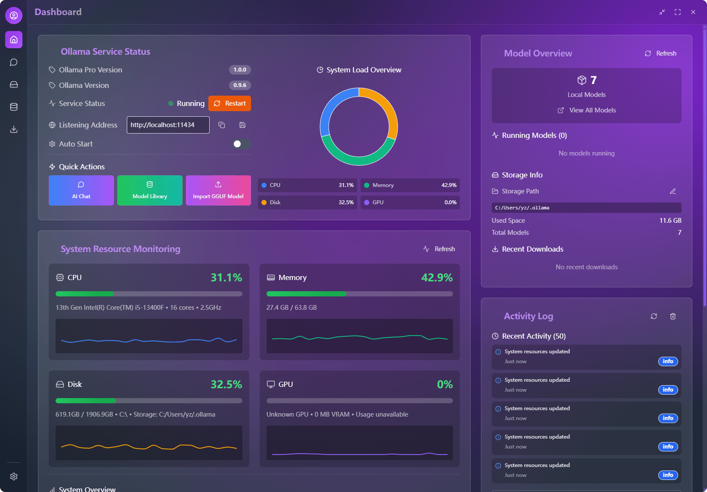
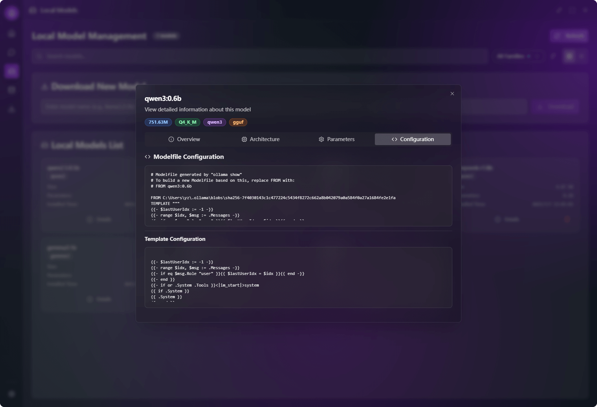

<div align="center">
<a href="https://github.com/putyy/res-downloader"></a>
<h1>Ollama Pro</h1>
</div>

**🌍 다국어 버전：**
[English](../../README.md) | [中文](../zh/README.md) | [日本語](../ja/README.md) | [Français](../fr/README.md)


[](https://github.com/downly-app/ollama.vip/stargazers)
[](https://github.com/downly-app/ollama.vip/fork)
[](LICENSE)
[](https://github.com/downly-app/ollama.vip/releases)
[](https://github.com/downly-app/ollama.vip/releases)

Ollama 모델과 상호작용하기 위한 현대적인 크로스 플랫폼 데스크톱 애플리케이션입니다. 최적의 성능과 보안을 위해 React, TypeScript, Tauri로 구축되었습니다.

> 🤖 **AI 기반 개발**: 이 프로젝트는 WindSurf + Cursor + Trae + Lovable(UI 및 프론트엔드 디자인) + Manus(초기 연구 및 요구사항 분석)를 사용한 AI 지원 코딩(vibe coding)으로 협력 개발되었으며, 주로 Claude 4와 Gemini 2.5 Pro 모델에 의해 구동됩니다.

**메인 대시보드 인터페이스:**



*메인 대시보드는 시스템 상태 개요, 모델 관리, 주요 기능에 대한 빠른 액세스를 제공합니다.*

## ✨ 기능

### 🤖 AI 채팅
- **다중 모델 지원**: OpenAI 및 DeepSeek 모델 지원
- **실시간 대화**: 부드러운 스트리밍 채팅 경험
- **메시지 관리**: 메시지 편집, 삭제, 복사, 재전송
- **대화 기록**: 검색 기능이 있는 영구 채팅 기록
- **Markdown 렌더링**: 코드 하이라이팅 및 포맷팅 완전 지원

**AI 채팅 인터페이스:**


*메시지 기록, 마크다운 지원, 실시간 스트리밍 응답을 갖춘 깔끔하고 직관적인 채팅 인터페이스.*

**서드파티 모델 API 구성:**


*OpenAI, DeepSeek 및 기타 AI 제공업체의 API 키와 매개변수를 구성하기 위한 간단한 설정 패널.*

### 🎨 사용자 인터페이스
- **현대적 디자인**: 부드러운 애니메이션이 있는 글래스모피즘 UI
- **테마 시스템**: 그라데이션 효과가 있는 여러 내장 테마
- **반응형 레이아웃**: 다양한 화면 크기에 적응하는 인터페이스
- **다크 모드**: 눈에 편한 다크 인터페이스
- **국제화**: 영어, 중국어, 일본어, 한국어, 프랑스어 지원

### 🔧 모델 관리
- **모델 개요**: 사용 가능한 AI 모델 표시 및 관리
- **제공업체 선택**: 다양한 AI 서비스 제공업체 간 전환
- **설정 관리**: 간편한 API 키 및 매개변수 구성

**로컬 모델 관리:**


*로컬에 설치된 모델의 포괄적인 보기로 모델 관리, 업데이트, 제거 옵션을 제공합니다.*

**로컬 모델 세부정보:**



*크기, 매개변수, 성능 메트릭을 포함한 각 모델의 상세 정보.*

**온라인 모델 라이브러리:**


*원클릭 다운로드 기능으로 Ollama 라이브러리에서 사용 가능한 모델을 탐색하고 발견합니다.*

**모델 정보 페이지:**


*다운로드 전 포괄적인 모델 세부정보(설명, 기능, 시스템 요구사항 포함).*

**다운로드 관리:**


*모델 설치의 일시정지, 재개, 취소 옵션이 있는 실시간 다운로드 진행률 추적.*

### ⚙️ 시스템 기능
- **크로스 플랫폼**: Windows, macOS, Linux 지원
- **네이티브 성능**: 최적의 성능을 위해 Tauri로 구축
- **데이터 지속성**: 설정 및 채팅 기록의 로컬 저장
- **키보드 단축키**: 효율적인 키보드 탐색

## 📦 설치

### 전제 조건

- [Ollama](https://ollama.ai/)가 설치되고 실행 중
- Node.js 18+ 및 Yarn (개발용)
- Rust (소스에서 빌드하는 경우)

### 사전 빌드된 바이너리 다운로드

1. [Releases](https://github.com/downly-app/ollama.vip/releases) 페이지 방문
2. 플랫폼에 적합한 설치 프로그램 다운로드:

#### Windows
- **MSI 설치 프로그램**: `ollama-pro_x.x.x_x64_en-US.msi` (권장)
- **NSIS 설치 프로그램**: `ollama-pro_x.x.x_x64-setup.exe`

#### macOS
- **DMG 패키지**: `ollama-pro_x.x.x_x64.dmg` (Intel)
- **DMG 패키지**: `ollama-pro_x.x.x_aarch64.dmg` (Apple Silicon)
- **App 번들**: `ollama-pro.app.tar.gz`

#### Linux
- **Debian 패키지**: `ollama-pro_x.x.x_amd64.deb` (Ubuntu/Debian)
- **RPM 패키지**: `ollama-pro_x.x.x_x86_64.rpm` (RHEL/Fedora/SUSE)
- **AppImage**: `ollama-pro_x.x.x_amd64.AppImage` (범용)

### 소스에서 빌드

```bash
# 저장소 복제
git clone https://github.com/downly-app/ollama.vip.git
cd ollama.vip

# 종속성 설치
yarn install

# 개발 서버 시작
yarn tauri:dev

# 프로덕션용 빌드
yarn tauri:build

# 또는 플랫폼별 빌드 스크립트 사용
# Windows
yarn build:all

# Linux/macOS
yarn build:all:unix
```

### 자동 빌드

우리의 GitHub Actions는 지원되는 모든 플랫폼용 릴리스를 자동으로 빌드합니다:
- ✅ Windows (x64)
- ✅ macOS (Intel & Apple Silicon)
- ✅ Linux (x64)

모든 빌드는:
- 🔒 **디지털 서명됨** (인증서가 사용 가능한 경우)
- 🛡️ **보안 스캔됨** (취약점 확인)
- 📦 **최적화됨** (크기 및 성능)
- 🧪 **테스트됨** (여러 환경에서 검증)

## 🚀 빠른 시작

1. **설치 및 실행**: 플랫폼용 애플리케이션을 다운로드하고 설치
2. **API 구성**: 설정을 열고 AI 제공업체 API 키 추가
3. **모델 선택**: 드롭다운에서 원하는 AI 모델 선택
4. **채팅 시작**: AI 어시스턴트와 대화 시작

## 📁 프로젝트 구조

```
ollama.vip/
├── src/                    # 프론트엔드 소스 코드
│   ├── components/         # React 컴포넌트
│   │   ├── ui/            # 기본 UI 컴포넌트
│   │   ├── layouts/       # 레이아웃 컴포넌트
│   │   └── ...
│   ├── pages/             # 페이지 컴포넌트
│   ├── stores/            # Zustand 상태 관리
│   ├── services/          # API 서비스
│   ├── utils/             # 유틸리티 함수
│   ├── contexts/          # React 컨텍스트
│   ├── i18n/              # 국제화
│   │   └── locales/       # 번역 파일
│   └── styles/            # CSS 스타일
├── src-tauri/             # Tauri 백엔드
│   ├── src/               # Rust 소스 코드
│   ├── Cargo.toml         # Rust 종속성
│   └── tauri.conf.json    # Tauri 구성
├── public/                # 정적 자산
└── docs/                  # 문서
```

## 🔧 구성

### API 구성
1. 애플리케이션 열기
2. 도구 모음의 설정 아이콘 클릭
3. API 제공업체 및 키 구성:
    - **OpenAI**: OpenAI API 키 입력
    - **DeepSeek**: DeepSeek API 키 입력
4. 원하는 모델 선택
5. 온도 및 기타 매개변수 조정

### 언어 설정
애플리케이션은 여러 언어를 지원합니다:
- 영어 (기본값)
- 중국어 (간체)
- 일본어
- 한국어
- 프랑스어

설정 > 언어 설정에서 언어를 변경하세요.

## 🛠️ 개발

### 기술 스택
- **프론트엔드**: React 18.3 + TypeScript 5.5
- **백엔드**: Tauri 1.5 + Rust
- **UI 프레임워크**: Tailwind CSS + Radix UI
- **상태 관리**: Zustand
- **빌드 도구**: Vite
- **국제화**: react-i18next

### AI 개발 도구
- **코드 에디터**: WindSurf + Cursor + Trae AI
- **UI/UX 디자인**: Lovable
- **연구 및 분석**: Manus
- **AI 모델**: Claude 4 + Gemini 2.5 Pro
- **개발 접근법**: Vibe Coding (AI 지원 개발)

### 개발 명령어
```bash
# 개발 서버 시작
npm run dev

# Tauri 개발 시작
npm run tauri dev

# 프로덕션용 빌드
npm run tauri build

# 타입 검사
npm run type-check

# 린팅
npm run lint

# 코드 포맷팅
npm run format
```

### 새 기능 추가
1. `src/components/`에 컴포넌트 생성
2. `src/pages/`에 페이지 추가
3. `src/stores/`의 Zustand 스토어로 상태 관리
4. `src/i18n/locales/`에 번역 추가
5. 적절한 `.d.ts` 파일로 타입 업데이트

## 📖 API 문서

### 채팅 API
애플리케이션은 여러 AI 제공업체를 지원합니다:

#### OpenAI
- 모델: GPT-4o, GPT-4o Mini, GPT-4 Turbo
- 엔드포인트: `https://api.openai.com/v1/chat/completions`

#### DeepSeek
- 모델: DeepSeek-V3, DeepSeek-R1
- 엔드포인트: `https://api.deepseek.com/v1/chat/completions`

### 구성 형식
```typescript
interface AIConfig {
  provider: 'openai' | 'deepseek';
  apiKey: string;
  model: string;
  temperature: number;
}
```

## 🧪 테스트

```bash
# 단위 테스트 실행
npm run test

# 통합 테스트 실행
npm run test:integration

# E2E 테스트 실행
npm run test:e2e
```

## 📦 빌드 및 배포

### 개발 빌드
```bash
npm run tauri dev
```

### 프로덕션 빌드
```bash
npm run tauri build
```

빌드 아티팩트는 `src-tauri/target/release/bundle/`에 생성됩니다.

### 플랫폼별 참고사항
- **Windows**: `.msi` 설치 프로그램 생성
- **macOS**: `.dmg` 및 `.app` 번들 생성
- **Linux**: `.deb` 및 `.AppImage` 생성

## 🔍 문제 해결

### 일반적인 문제

1. **포트 1421이 이미 사용 중**
   ```bash
   # 포트를 사용하는 프로세스 종료
   npx kill-port 1421
   # 또는
   lsof -ti:1421 | xargs kill -9
   ```

2. **Tauri 빌드 실패**
    - Rust가 올바르게 설치되었는지 확인
    - Tauri CLI 업데이트: `cargo install tauri-cli`
    - 캐시 지우기: `cargo clean`

3. **API 연결 문제**
    - API 키가 올바른지 확인
    - 네트워크 연결 확인
    - API 엔드포인트에 액세스할 수 있는지 확인

### 디버그 모드
환경 변수를 설정하여 디버그 모드 활성화:
```bash
TAURI_DEBUG=true npm run tauri dev
```

## 🤝 기여

기여를 환영합니다! 자세한 내용은 [기여 가이드](docs/CONTRIBUTING.md)를 참조하세요.

### 개발 워크플로
1. 저장소 포크
2. 기능 브랜치 생성
3. 변경사항 적용
4. 해당하는 경우 테스트 추가
5. 풀 리퀘스트 제출

### 코드 스타일
- 타입 안전성을 위해 TypeScript 사용
- ESLint 구성 따르기
- 코드 포맷팅에 Prettier 사용
- 의미 있는 커밋 메시지 작성

## 📄 라이선스

이 프로젝트는 상업적 예외 조항이 있는 GNU 일반 공중 사용 허가서 v3 하에 라이선스됩니다.

### 오픈소스 사용
비상업적 사용(개인, 교육, 연구)의 경우 이 소프트웨어는 GPL v3 조항 하에 사용할 수 있습니다.

### 상업적 사용
상업적 사용에는 별도의 상업 라이선스가 필요합니다. 상업 라이선스에 대해서는 [yzmm@outlook.com]로 문의하세요.

자세한 내용은 [LICENSE](LICENSE) 파일을 참조하세요.

## 🙏 감사의 말

### 프레임워크 및 라이브러리
- [Tauri](https://tauri.app/) - 훌륭한 데스크톱 앱 프레임워크
- [React](https://reactjs.org/) - UI 라이브러리
- [Tailwind CSS](https://tailwindcss.com/) - 유틸리티 우선 CSS 프레임워크
- [Radix UI](https://www.radix-ui.com/) - 접근 가능한 UI 컴포넌트
- [Zustand](https://github.com/pmndrs/zustand) - 상태 관리

### AI 개발 도구
- [WindSurf](https://codeium.com/windsurf) - AI 기반 코드 에디터
- [Cursor](https://cursor.sh/) - AI 우선 코드 에디터
- [Trae AI](https://trae.ai/) - 고급 AI 코딩 어시스턴트
- [Lovable](https://lovable.dev/) - AI 기반 UI/UX 디자인
- [Manus](https://manus.ai/) - AI 연구 및 분석 플랫폼
- [Claude 4](https://claude.ai/) - Anthropic의 고급 AI 언어 모델
- [Gemini 2.5 Pro](https://gemini.google.com/) - Google의 고급 AI 모델

### 개발 철학
이 프로젝트는 인간의 창의성과 AI 능력이 협력하여 혁신적인 소프트웨어 솔루션을 만들어내는 **AI 지원 개발**(vibe coding)의 힘을 보여줍니다.

## 지원

문제가 발생하거나 질문이 있는 경우:
- [GitHub Issues](https://github.com/downly-app/ollama.vip/issues)에서 이슈 생성
- [문서](docs/) 확인
- 커뮤니티 토론 참여
- 상업 라이선스 문의: [yzmm@outlook.com]