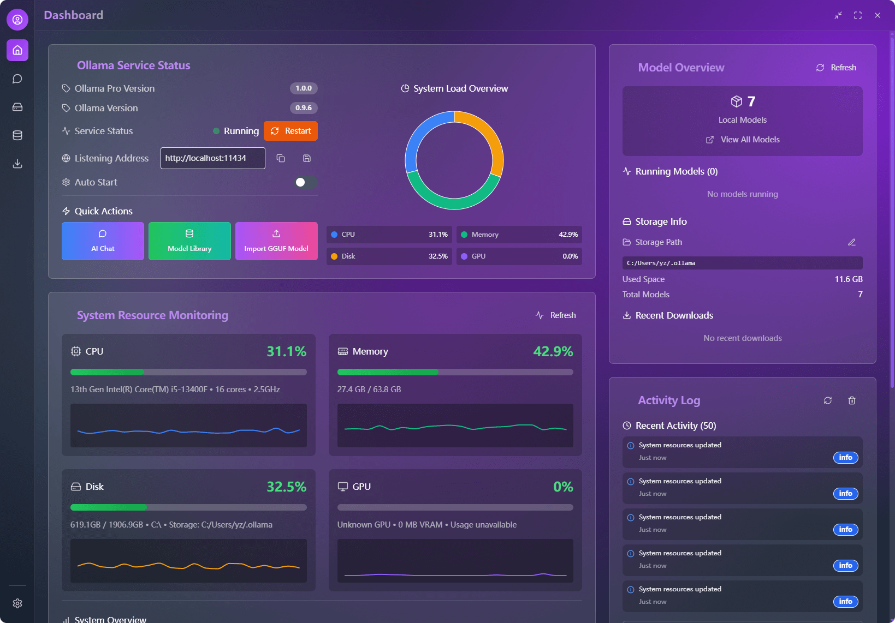
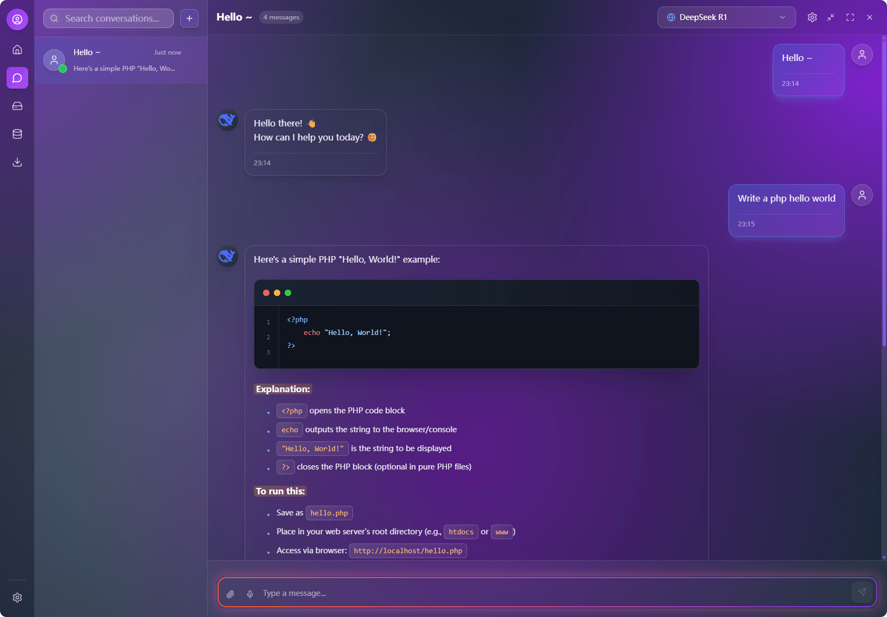
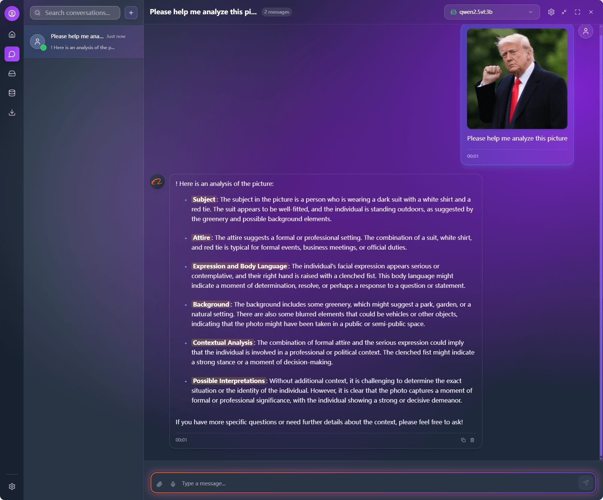
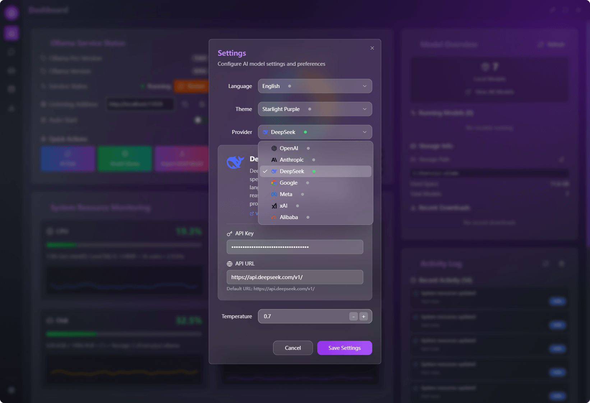
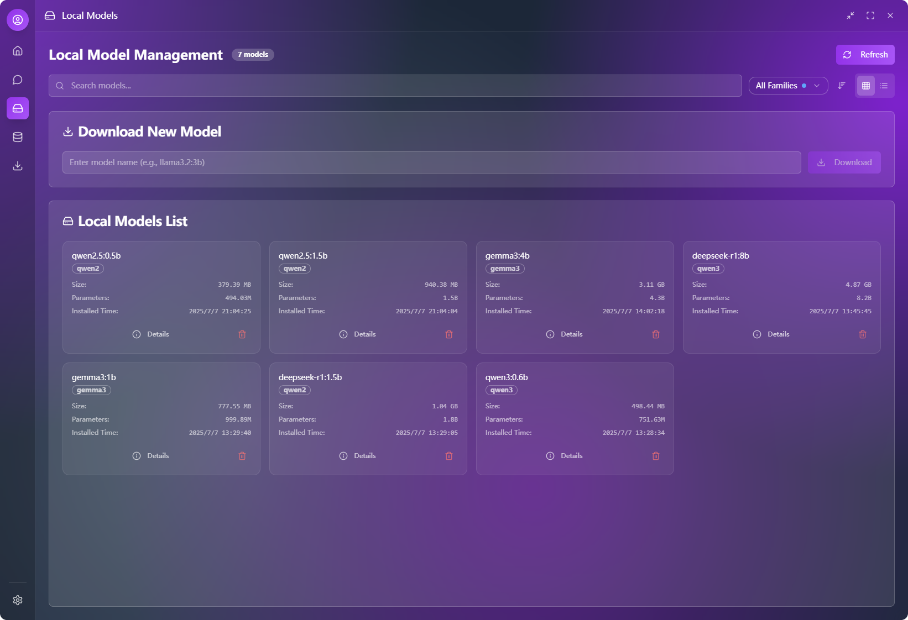
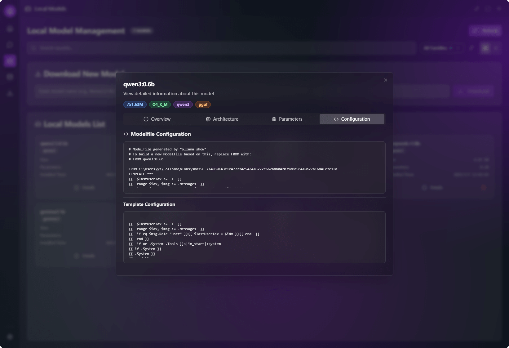
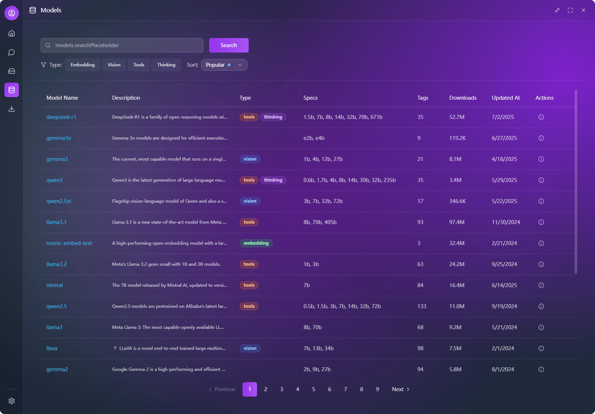
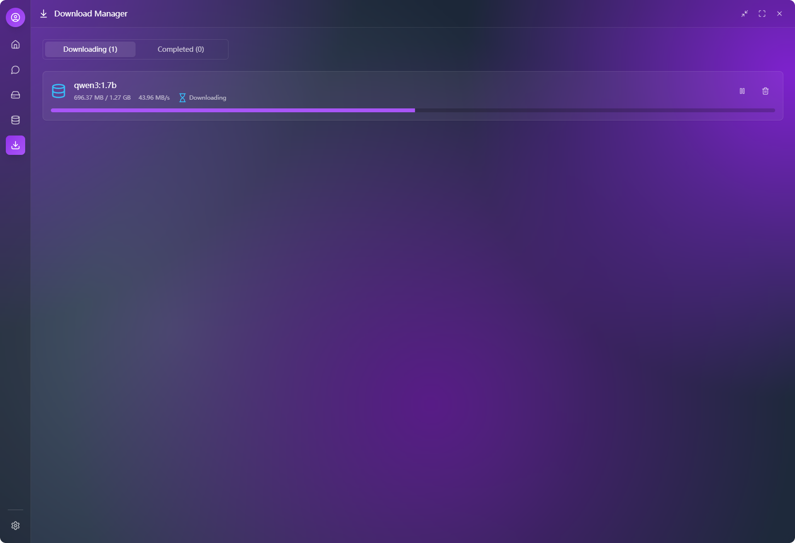

<div align="center">
<a href="https://github.com/putyy/res-downloader"></a>
<h1>Ollama Pro</h1>
</div>

**🌍 多语言版本：**

[English](../../README.md) | 中文 | [日本語](../ja/README.md) | [한국어](../ko/README.md) | [Français](../fr/README.md)

[](https://github.com/downly-app/ollama.vip/stargazers)
[](https://github.com/downly-app/ollama.vip/fork)
[](LICENSE)
[](https://github.com/downly-app/ollama.vip/releases)
[](https://github.com/downly-app/ollama.vip/releases)

一个现代化的跨平台桌面应用程序，用于与 Ollama 模型交互。使用 React、TypeScript 和 Tauri 构建，具有最佳性能和安全性。

> 🤖 **AI 驱动开发**: 本项目采用 AI 辅助编程（vibe coding）协作开发，使用 WindSurf + Cursor + Trae + Lovable（UI 和前端设计）+ Manus（早期研究和需求分析），主要由 Claude 4 和 Gemini 2.5 Pro 模型驱动。

**主仪表板界面：**



*主仪表板提供系统状态概览、模型管理和关键功能的快速访问。*

## ✨ 功能特性

### 🤖 AI 聊天
- **多模型支持**: 兼容 OpenAI 和 DeepSeek 模型
- **实时对话**: 流畅的流式聊天体验
- **消息管理**: 编辑、删除、复制和重发消息
- **对话历史**: 持久化聊天历史记录和搜索功能
- **Markdown 渲染**: 完整支持代码高亮和格式化

**AI 聊天界面：**



*简洁直观的聊天界面，支持消息历史、Markdown和实时流式响应。*



*无缝融合文本与图片，开启更丰富、更具上下文的对话。*

**第三方模型 API 配置：**



*便捷的配置面板，用于设置 OpenAI、DeepSeek 和其他 AI 提供商的 API 密钥和参数。*

### 🎨 用户界面
- **现代设计**: 玻璃态 UI 和流畅动画
- **主题系统**: 多种内置主题和渐变效果
- **响应式布局**: 适应不同屏幕尺寸的界面
- **深色模式**: 护眼的深色界面
- **国际化**: 支持英语、中文、日语、韩语和法语

### 🔧 模型管理
- **模型概览**: 查看和管理可用的 AI 模型
- **提供商选择**: 在不同 AI 服务提供商之间切换
- **配置管理**: 简便的 API 密钥和参数配置

**本地模型管理：**



*本地安装模型的全面视图，提供管理、更新和删除模型的选项。*

**本地模型详情：**



*每个模型的详细信息，包括大小、参数和性能指标。*

**在线模型库：**



*浏览和发现 Ollama 库中的可用模型，支持一键下载功能。*

**模型信息页面：**


*下载前的全面模型详情，包括描述、功能和系统要求。*

**下载管理：**



*实时下载进度跟踪，支持暂停、恢复和取消模型安装。*

### ⚙️ 系统功能
- **跨平台**: 支持 Windows、macOS 和 Linux
- **原生性能**: 使用 Tauri 构建，性能最佳
- **数据持久化**: 本地存储设置和聊天历史
- **键盘快捷键**: 高效的键盘导航

## 📦 安装

### 前置要求

- 安装并运行 [Ollama](https://ollama.ai/)
- Node.js 18+ 和 Yarn（用于开发）
- Rust（用于从源码构建）

### 下载预构建二进制文件

1. 访问 [Releases](https://github.com/downly-app/ollama.vip/releases) 页面
2. 下载适合您平台的安装程序：

#### Windows
- **MSI 安装程序**: `ollama-pro_x.x.x_x64_en-US.msi`（推荐）
- **NSIS 安装程序**: `ollama-pro_x.x.x_x64-setup.exe`

#### macOS
- **DMG 包**: `ollama-pro_x.x.x_x64.dmg`（Intel）
- **DMG 包**: `ollama-pro_x.x.x_aarch64.dmg`（macOS M系列的苹果芯片）
- **App 包**: `ollama-pro.app.tar.gz`

> [!WARNING]
> **macOS 特别说明：**
> 如果您在打开应用时遇到“文件已损坏”的提示，请在终端中执行以下命令。这是由于该应用尚未经过苹果公证（Notarized）导致的。
> ```bash
> sudo xattr -rd com.apple.quarantine /Applications/ollama-pro.app
> ```
> *如果您将应用安装到了其他路径，请将 `/Applications/ollama-pro.app` 替换为实际的应用路径。*

#### Linux
- **Debian 包**: `ollama-pro_x.x.x_amd64.deb`（Ubuntu/Debian）
- **RPM 包**: `ollama-pro_x.x.x_x86_64.rpm`（RHEL/Fedora/SUSE）
- **AppImage**: `ollama-pro_x.x.x_amd64.AppImage`（通用）

### 从源码构建

```bash
# 克隆仓库
git clone https://github.com/downly-app/ollama.vip.git
cd ollama.vip

# 安装依赖
yarn install

# 启动开发服务器
yarn tauri:dev

# 生产构建
yarn tauri:build

# 或使用平台特定的构建脚本
# Windows
yarn build:all

# Linux/macOS
yarn build:all:unix
```

### 自动化构建

我们的 GitHub Actions 自动为所有支持的平台构建发布版本：
- ✅ Windows (x64)
- ✅ macOS (Intel & Apple Silicon)
- ✅ Linux (x64)

所有构建都具有：
- 🔒 **数字签名**（当证书可用时）
- 🛡️ **安全扫描**漏洞检测
- 📦 **优化**大小和性能
- 🧪 **测试**跨多个环境

## 🚀 快速开始

1. **安装和启动**: 下载并安装适合您平台的应用程序
2. **配置 API**: 打开设置并添加您的 AI 提供商 API 密钥
3. **选择模型**: 从下拉菜单中选择您首选的 AI 模型
4. **开始聊天**: 开始与 AI 助手对话

## 📁 项目结构

```
ollama.vip/
├── src/                    # 前端源代码
│   ├── components/         # React 组件
│   │   ├── ui/            # 基础 UI 组件
│   │   ├── layouts/       # 布局组件
│   │   └── ...
│   ├── pages/             # 页面组件
│   ├── stores/            # Zustand 状态管理
│   ├── services/          # API 服务
│   ├── utils/             # 工具函数
│   ├── contexts/          # React 上下文
│   ├── i18n/              # 国际化
│   │   └── locales/       # 翻译文件
│   └── styles/            # CSS 样式
├── src-tauri/             # Tauri 后端
│   ├── src/               # Rust 源代码
│   ├── Cargo.toml         # Rust 依赖
│   └── tauri.conf.json    # Tauri 配置
├── public/                # 静态资源
└── docs/                  # 文档
```

## 🔧 配置

### API 配置
1. 打开应用程序
2. 点击工具栏中的设置图标
3. 配置您的 API 提供商和密钥：
    - **OpenAI**: 输入您的 OpenAI API 密钥
    - **DeepSeek**: 输入您的 DeepSeek API 密钥
4. 选择您首选的模型
5. 调整温度和其他参数

### 语言设置
应用程序支持多种语言：
- 英语（默认）
- 中文（简体）
- 日语
- 韩语
- 法语

在设置 > 语言设置中更改语言。

## 🛠️ 开发

### 技术栈
- **前端**: React 18.3 + TypeScript 5.5
- **后端**: Tauri 1.5 + Rust
- **UI 框架**: Tailwind CSS + Radix UI
- **状态管理**: Zustand
- **构建工具**: Vite
- **国际化**: react-i18next

### AI 开发工具
- **代码编辑器**: WindSurf + Cursor + Trae AI
- **UI/UX 设计**: Lovable
- **研究与分析**: Manus
- **AI 模型**: Claude 4 + Gemini 2.5 Pro
- **开发方法**: Vibe Coding（AI 辅助开发）

### 开发命令
```bash
# 启动开发服务器
npm run dev

# 启动 Tauri 开发
npm run tauri dev

# 生产构建
npm run tauri build

# 类型检查
npm run type-check

# 代码检查
npm run lint

# 格式化代码
npm run format
```

### 添加新功能
1. 在 `src/components/` 中创建组件
2. 在 `src/pages/` 中添加页面
3. 使用 `src/stores/` 中的 Zustand 存储管理状态
4. 在 `src/i18n/locales/` 中添加翻译
5. 在相应的 `.d.ts` 文件中更新类型

## 📖 API 文档

### 聊天 API
应用程序支持多个 AI 提供商：

#### OpenAI
- 模型: GPT-4o, GPT-4o Mini, GPT-4 Turbo
- 端点: `https://api.openai.com/v1/chat/completions`

#### DeepSeek
- 模型: DeepSeek-V3, DeepSeek-R1
- 端点: `https://api.deepseek.com/v1/chat/completions`

### 配置格式
```typescript
interface AIConfig {
  provider: 'openai' | 'deepseek';
  apiKey: string;
  model: string;
  temperature: number;
}
```

## 🧪 测试

```bash
# 运行单元测试
npm run test

# 运行集成测试
npm run test:integration

# 运行端到端测试
npm run test:e2e
```

## 📦 构建和分发

### 开发构建
```bash
npm run tauri dev
```

### 生产构建
```bash
npm run tauri build
```

构建产物将在 `src-tauri/target/release/bundle/` 中生成。

### 平台特定说明
- **Windows**: 生成 `.msi` 安装程序
- **macOS**: 生成 `.dmg` 和 `.app` 包
- **Linux**: 生成 `.deb` 和 `.AppImage`

## 🔍 故障排除

### 常见问题

1. **端口 1421 已被使用**
   ```bash
   # 终止使用该端口的进程
   npx kill-port 1421
   # 或
   lsof -ti:1421 | xargs kill -9
   ```

2. **Tauri 构建失败**
    - 确保 Rust 已正确安装
    - 更新 Tauri CLI: `cargo install tauri-cli`
    - 清除缓存: `cargo clean`

3. **API 连接问题**
    - 验证 API 密钥是否正确
    - 检查网络连接
    - 确保 API 端点可访问

### 调试模式
通过设置环境变量启用调试模式：
```bash
TAURI_DEBUG=true npm run tauri dev
```

## 🤝 贡献

我们欢迎贡献！请查看我们的[贡献指南](../../docs/en/CONTRIBUTING.md)了解详情。

### 开发工作流程
1. Fork 仓库
2. 创建功能分支
3. 进行更改
4. 如适用，添加测试
5. 提交拉取请求

### 代码风格
- 使用 TypeScript 确保类型安全
- 遵循 ESLint 配置
- 使用 Prettier 格式化代码
- 编写有意义的提交消息

## 📄 许可证

本项目采用 GNU 通用公共许可证 v3 和商业例外条款。

### 开源使用
对于非商业用途（个人、教育、研究），本软件在 GPL v3 条款下可用。

### 商业使用
商业使用需要单独的商业许可证。请联系 [yzmm@outlook.com] 获取商业许可。

详情请参阅 [LICENSE](../../LICENSE) 文件。

## 🙏 致谢

### 框架和库
- [Tauri](https://tauri.app/) - 出色的桌面应用框架
- [React](https://reactjs.org/) - UI 库
- [Tailwind CSS](https://tailwindcss.com/) - 实用优先的 CSS 框架
- [Radix UI](https://www.radix-ui.com/) - 可访问的 UI 组件
- [Zustand](https://github.com/pmndrs/zustand) - 状态管理

### AI 开发工具
- [WindSurf](https://codeium.com/windsurf) - AI 驱动的代码编辑器
- [Cursor](https://cursor.sh/) - AI 优先的代码编辑器
- [Trae AI](https://trae.ai/) - 高级 AI 编程助手
- [Lovable](https://lovable.dev/) - AI 驱动的 UI/UX 设计
- [Manus](https://manus.ai/) - AI 研究和分析平台
- [Claude 4](https://claude.ai/) - Anthropic 的高级 AI 语言模型
- [Gemini 2.5 Pro](https://gemini.google.com/) - Google 的高级 AI 模型

### 开发理念
本项目展示了 **AI 辅助开发**（vibe coding）的力量，人类创造力和 AI 能力协同工作，创造创新的软件解决方案。

## 支持

如果您遇到任何问题或有疑问：
- 在 [GitHub Issues](https://github.com/downly-app/ollama.vip/issues) 创建问题
- 查看[文档](docs/)
- 加入我们的社区讨论
- 商业许可咨询：[yzmm@outlook.com]